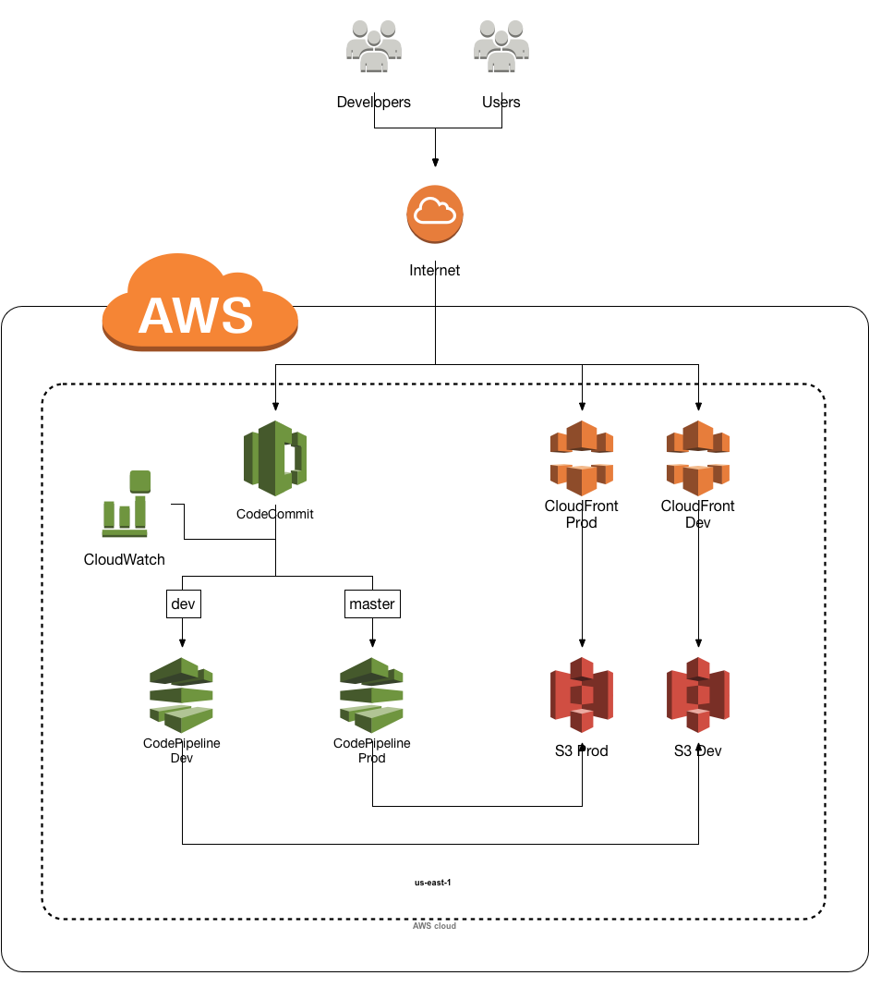

# DevOps Pipelines
In this workshop, we:
* setup a git repo managed in CodeCommit
* created a dev branch
* setup static hosting for dev and prod versions of the website
* created pipelines that deploy to both on commit

