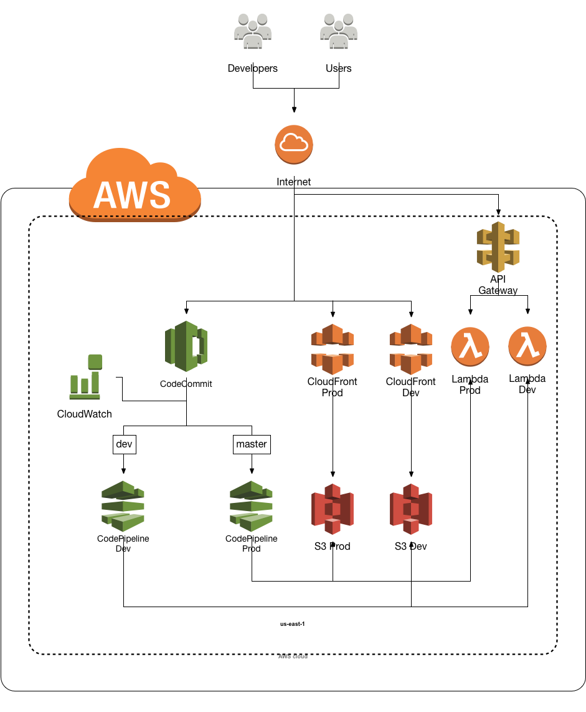
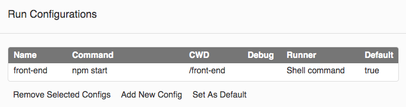

# Single Page App
In this workshop, we:
* Set up our cloud9 environment
* Create a react front end
* Update our pipelines to build and deploy the react front end
* Create a stub lambda function to act as a rest api
* Update our pipelines to build and deploy the lambda



## Steps

### Set up Cloud9
* Walk through on setting up cloud9
* Connect to our repo

```
git config --global credential.helper '!aws codecommit credential-helper $@'
git config --global credential.UseHttpPath true
git init
git remote add origin https://git-codecommit.us-east-1.amazonaws.com/v1/repos/she-can-code-it
git fetch
git reset origin/master
git reset --hard
git checkout dev
```

### Create our front end
* Use create react app!
```
nvm alias default 8
npx create-react-app front-end
```
* Create our front end run config


### Update our pipelines
* Create build steps. Make sure to choose node 10.
* Add it to our pipelines


### Publish the latest
* Commit to dev
```
git add .
git commit -m "React front end"
git push -u origin dev
```
* Verify dev
* Merge into master
* Verify prod

### Create our serverless backend
* Serverless quick start:
```
npm install -g serverless
serverless create --template aws-nodejs --path back-end
```
* Update serverless.yml
* Deploy a local version
```
serverless deploy --stage local
serverless deploy --stage dev
serverless deploy --stage prod
```
* Note the URL of each stage, we need them for our build steps
* Verify you can call it
* Update your function to return an array of posts
* Include a CORS header: 'Access-Control-Allow-Origin': '*'
* Integrate it into your react app

### Create serverless deploy steps
Sample buildspec - dev:
```
version: 0.2

phases:
  install:
    commands:
       - cd back-end
       - npm install -g serverless
  build:
    commands:
       - serverless deploy --stage dev
```

### Publish the latest
* Commit to dev
```
git add .
git commit -m "Serverless back end"
git push -u origin dev
```
* Verify dev
* Merge into master
* Verify prod